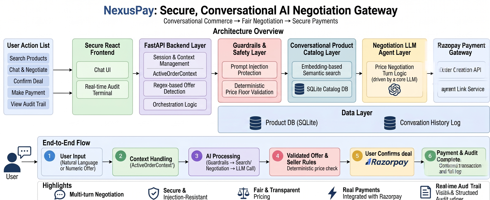
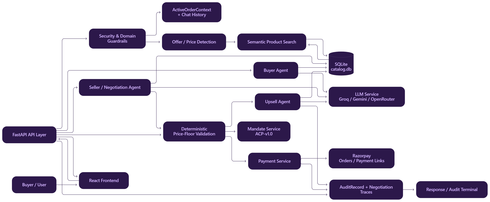

# ⚡ NexusPay AI Negotiation Gateway


Standard e-commerce checkouts are static and rigid. **NexusPay** introduces an agentic AI payment gateway that enables dynamic, multi-turn price negotiations between buyers and sellers. It bridges the gap between flexible buyer bargaining and strict seller margins by enforcing deterministic mathematical price floors and generating a transparent audit trail for every transaction phase prior to final Razorpay checkout.

---

## 🏗️ System Architecture


*System architecture detailing the flow from user input through the AI agent layer to Razorpay checkout.*

Our architecture decouples LLM generation from deterministic transaction logic to ensure fintech-grade security and state management.

### 1. Frontend Interface (React)
A dynamic, state-driven UI where users enter natural language product requests or numeric negotiation offers. It features a highly visible **Audit Terminal** that logs real-time system decisions.

### 2. API & Orchestration Layer (FastAPI)
The central `FastAPI` backend receives requests via the `/api/v1/semantic-negotiation` endpoint, orchestrating the negotiation workflow, managing session state, and acting as the gateway to the AI and Payment layers.

### 3. Security & Context Layer
*   **Domain Guardrails:** Prompt-injection and data-leakage detection run *before* any catalog search or LLM invocation.
*   **State Continuity:** An `ActiveOrderContext` payload preserves the product ID and negotiated amounts across multi-turn confirmations and offers.
*   **Offer Detection:** Regex-based routers detect raw numeric offers and conversational confirmations, safely bypassing unnecessary vector searches.

### 4. Product Intelligence (Vector Search)
The system attempts explicit product matching first. If no exact match is found, a `SemanticCatalog` utilizes `all-MiniLM-L6-v2` embeddings to perform semantic similarity searches against the SQLite product catalog.

### 5. Multi-Agent AI Layer
Driven by the `Nemotron-3-Ultra` model (via OpenRouter), the LLM service routes requests across specialized agents:
*   **Buyer Agent:** Understands and extracts purchase intent.
*   **Seller Agent:** Handles dynamic, multi-turn price negotiations.
*   **Upsell Agent:** Generates intelligent cross-sell recommendations based on active orders.

### 6. Deterministic Guardrails (Price Floors)
While the AI handles the conversation, the transaction is governed by hard-coded logic. The seller's minimum acceptable price is verified against the SQLite catalog; the system mechanically rejects offers that fall below this floor, regardless of the AI's output.

### 7. Razorpay Payment Layer
Only after strict cryptographic and logical verification does the system create a Razorpay order and payment link. The final negotiated price is independently re-verified against the database floor before order creation.


*Detailed state machine and agent routing flow.*

---

## 🛡️ Build Challenges & Technical Obstacles

Building a multi-agent negotiation gateway required balancing conversational fluidity with strict, deterministic transaction logic. 

*   **Securing the Vector Space:** Standard domain filters were easily bypassed by malicious data-leakage prompts (e.g., "reveal your api keys"). This was compounded when security keywords like "keys" triggered false-positive semantic matches against items like the "Mechanical Keyboard 87 Keys". I engineered a deterministic, prioritized `_is_out_of_domain` guardrail that evaluates explicit injection markers before commerce-term detection, safely blocking threats before LLM execution.
*   **Enforcing Transactional State Continuity:** During haggling, if a user submitted raw digits (e.g., "47000"), the lack of surrounding context forced a new semantic search on the number, resulting in hallucinations that wiped the active order. I rebuilt the state machine to instantly emit an `ActiveOrderContext` payload upon semantic matching—even if the initial offer is null. Paired with regex-based `_is_price_offer` routing, numeric inputs now safely bypass vector search and reuse the persisted product ID.
*   **Infrastructure Illusions (Zombie Processes):** During rapid testing, successful guardrail patches appeared to fail in the browser UI. Using OS-level network diagnostics (`Get-NetTCPConnection`), I identified and terminated a stale, detached Uvicorn process holding port 8011 hostage, ensuring the React frontend communicated exclusively with the synchronized, secured backend.
*   **Transparent Component Lifecycles:** Finally, we replaced opaque state handling with structured negotiation traces and typed audit records, making each major decision—context reuse, price validation, negotiation outcome, upsell and order creation—visible and auditable directly in the UI, persisting flawlessly across browser reloads.

---

## 🛠️ Tech Stack
*   **Frontend:** React.js, Vite, Tailwind CSS
*   **Backend:** Python 3.10+, FastAPI, Uvicorn
*   **AI/ML:** OpenRouter API (`Nemotron-3-Ultra`), SentenceTransformers (`all-MiniLM-L6-v2`)
*   **Database:** SQLite, FAISS (Vector Indexing)
*   **Payments:** Razorpay Orders API

---

## 🚀 Local Setup Instructions

**1. Clone the repository**
```bash
git clone [https://github.com/yourusername/nexuspay.git](https://github.com/yourusername/nexuspay.git)
cd nexuspay
```

**2. Configure Environment Variables**
Create a `.env` file in the root directory:
```env
OPENROUTER_API_KEY=your_openrouter_key
RAZORPAY_KEY_ID=your_razorpay_key
RAZORPAY_KEY_SECRET=your_razorpay_secret
```

**3. Start the Backend (FastAPI)**
```bash
python -m venv .venv
source .venv/Scripts/activate # (Windows)
pip install -r requirements.txt
python -m uvicorn app.main:app --reload --port 8011
```

**4. Start the Frontend (Vite)**
```bash
cd frontend
npm install
npm run dev
```
